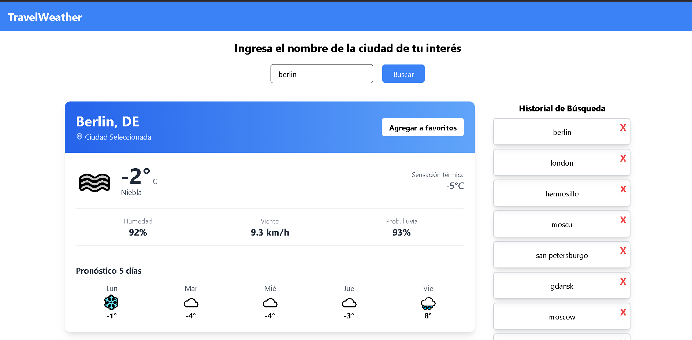
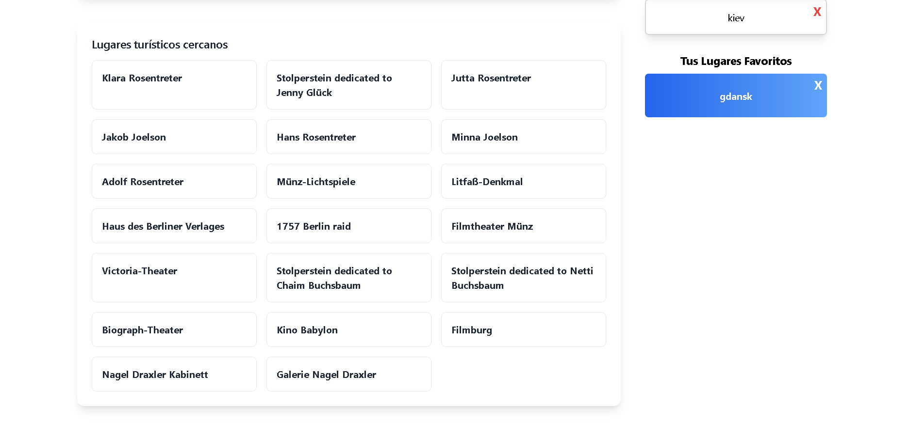

<div align="center">

# 🌤️ TravelWeather

### Conoce el clima de cualquier ciudad en tiempo real

</div>

---

## 📝 Descripción del proyecto

Aplicación enfocada a ayudar a los usuarios a conocer el estado climático de una ciudad en particular. Cuenta con funciones de **historial**, **favoritos** y **renderizado dinámico** para una experiencia fluida e intuitiva.

---

## 📸 Capturas de pantalla

| Vista principal | Otra vista |
|:-:|:-:|
|  |  |

---

## 🚀 Instalación y ejecución

### 1. Clona el repositorio

```bash
git clone https://github.com/kacto1973/weather-app
```

### 2. Instala la extensión de VSCode

> **Live Server** — *Ritwick Dey*
>
> Búscala directamente en el panel de extensiones de VSCode (`Ctrl+Shift+X`).

### 3. Ejecuta la aplicación

1. Haz **click derecho** sobre el archivo `index.html`
2. Selecciona **"Open with Live Server"**

¡Listo! La aplicación se abrirá automáticamente en tu navegador. 🎉

---

## 🌐 Demo en vivo

**👉 [travel-weather-program.netlify.app](https://travel-weather-program.netlify.app/)**
